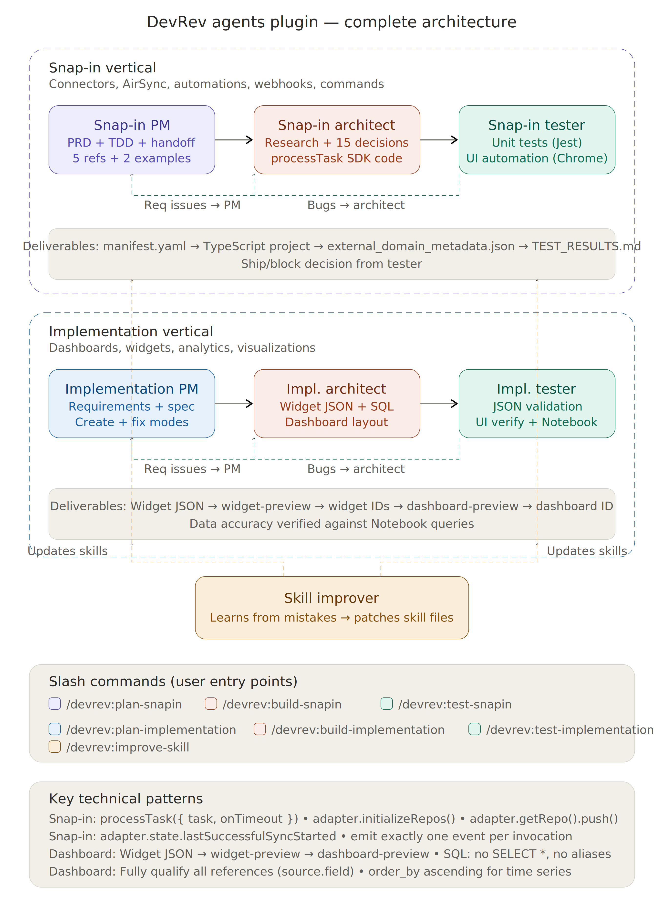

# DevRev Agents

AI-powered agents that plan, build, and test snap-ins, connectors, and dashboards on DevRev's AgentOS platform.

> **Stop building DevRev connectors and dashboards manually.** These agents handle the full pipeline — from gathering requirements to generating deployable code/configs to running end-to-end tests.

## Architecture



## What's inside

### Snap-in vertical (v1.0)

| Agent | What it does |
|-------|-------------|
| **Snap-in PM** | Gathers requirements, validates feasibility, creates PRDs and TDDs matching real DevRev document patterns, gets approval before development |
| **Snap-in Architect** | Researches external APIs (never guesses), makes 15 engineering decisions, generates complete deployable projects using ADaaS SDK |
| **Snap-in Tester** | Writes Jest unit tests, performs UI automation via browser to install snap-in, configure mapping, run sync, and verify imported data |

### Implementation vertical (v1.2)

Three domains, one pipeline — dashboards, workflows, and custom objects.

| Agent | What it does |
|-------|-------------|
| **Implementation PM** | Classifies the request by domain (dashboard / workflow / object), runs focused discovery rounds (3-5 questions each), produces a domain-tagged `spec.md` |
| **Implementation Architect** | Routes on the `domain:` tag in `spec.md` — generates widget + dashboard JSON for dashboards, AMC workflow templates for automations, or custom `leaf-type-schema.json` for object customizations. Uses the DevRev API CLI for live schema grounding |
| **Implementation Tester** | Static JSON lint + live schema check via `bin/devrev-api` + dry-run import. Domain-specific validation checklists for each output type |

**Domain → output mapping:**

| Domain | Output files |
|--------|-------------|
| `dashboard` | `widget-*.json` + `dashboard.json` |
| `workflow` | `workflow-template.json` |
| `object` | `leaf-type-schema.json` |

### Cross-cutting

| Agent | What it does |
|-------|-------------|
| **Skill Improver** | Diagnoses agent mistakes, traces errors to specific reference files, applies targeted fixes to prevent repeats |

## Quick Setup (one command)

### Claude Code

```bash
/plugin install --github QK-SnapIn/devrev-qk-agents
```

That's it. All 7 agents, 11 commands, and 7 skills are ready to use.

### DevRev API credentials (required for implementation vertical)

The implementation commands use a local CLI tool (`bin/devrev-api`) to ground JSON generation against your live DevRev schema. Set it up once:

**1. Create the config file:**

```bash
mkdir -p ~/.devrev
cat > ~/.devrev/config.json << 'EOF'
{
  "pat": "<your DevRev PAT>",
  "base_url": "https://api.devrev.ai"
}
EOF
chmod 600 ~/.devrev/config.json
```

Your PAT is in DevRev → Settings → API tokens. Keep `~/.devrev/config.json` out of version control.

**2. Make the CLI executable:**

```bash
chmod +x devrev-agents/bin/devrev-api
```

**3. Smoke test:**

```bash
devrev-agents/bin/devrev-api list-operations | jq '.operations | length'
```

Should return a number. If it errors, check your PAT and `base_url`.

### MCP Server Setup (Required for snap-in commands)

The snap-in commands require the **Snap-in Builder MCP** server for guides, validation, and code templates.

**Claude Code:**

```bash
claude mcp add snapin-builder --transport http -s project https://snapin-builder-mcp.onrender.com/mcp
```

**Cursor** — add to `.cursor/mcp.json`:

```json
{
  "mcpServers": {
    "snapin-builder": {
      "type": "streamable-http",
      "url": "https://snapin-builder-mcp.onrender.com/mcp"
    }
  }
}
```


### Update to latest

```bash
/devrev:update
```

### Local development

```bash
git clone https://github.com/QK-SnapIn/devrev-qk-agents.git
cd devrev-qk-agents
claude --plugin-dir .
```

### Cursor

```bash
git clone https://github.com/QK-SnapIn/devrev-qk-agents.git
cp -r devrev-qk-agents/devrev-agents/skills/* /path/to/your/project/.cursor/skills/
```

## Commands

| Command | What it does |
|---------|-------------|
| `/devrev:plan-snapin` | Plan a snap-in or AirSync connector (PM agent) |
| `/devrev:build-snapin` | Build complete deployable snap-in code (Architect agent) |
| `/devrev:test-snapin` | Test with unit tests + UI automation (Tester agent) |
| `/devrev:update-snapin` | Update an existing snap-in (add entity, fix pagination, switch auth) |
| `/devrev:generate-metadata` | Generate metadata + mapping JSON with validation |
| `/devrev:search-guide` | Quick reference lookup for AirSync patterns |
| `/devrev:plan-implementation` | Plan dashboards, widgets, analytics (PM agent) |
| `/devrev:build-implementation` | Generate widget JSON + dashboard layout (Architect agent) |
| `/devrev:test-implementation` | JSON validation + UI verification (Tester agent) |
| `/devrev:improve-skill` | Report mistakes, update agent skills (Self-learning agent) |
| `/devrev:update` | Update plugin to the latest version |

## Usage

### Snap-in vertical

```bash
# Plan a connector
/devrev:plan-snapin Build an AirSync connector for HubSpot

# Build the code
/devrev:build-snapin Implement the HubSpot connector from the approved TDD

# Test it
/devrev:test-snapin Write unit tests and run E2E test for the HubSpot connector
```

### Implementation vertical

```bash
# Dashboard
/devrev:plan-implementation I need a CSAT dashboard broken down by agent and ticket type
/devrev:build-implementation
/devrev:test-implementation

# Workflow automation
/devrev:plan-implementation Send a weekly status digest to Slack every Monday at 9am
/devrev:build-implementation
/devrev:test-implementation

# Custom object type
/devrev:plan-implementation Add a Priority Reason field to support tickets with 4 enum values
/devrev:build-implementation
/devrev:test-implementation
```

The PM agent auto-classifies the domain from your description — you don't specify it manually.

## How the pipelines work

See the [architecture diagram above](#architecture) for the complete flow. Both verticals follow the same pattern:

**PM** (plan) → **Architect** (build) → **Tester** (verify) — with bugs flowing back upstream:
- **Code bugs** (wrong API call, bad manifest, SDK error) → back to **Architect**
- **Requirements bugs** (missing field, wrong scope, unclear mapping) → back to **PM**
- **Systematic agent errors** (skill produces same mistake repeatedly) → **Skill Improver**

## Key technical facts

### Snap-in development
- Uses `processTask({ task, onTimeout })` — SDK manages timeout, not manual tracking
- `adapter.initializeRepos()` + `.push()` for automatic batching
- Platform provides `lastSuccessfulSyncStarted` — no webhook registration
- `chef-cli validate-metadata` + `configure-mappings` for AirSync
- Architect researches real API docs before writing code (never hallucinates)
- 15 engineering decisions documented before any code generation

### Implementation vertical

**Dashboards:**
- Widget JSON → `widget-preview` → widget ID → `dashboard-preview` → dashboard ID
- Widget structure: `data_sources` (oasis) → `dimensions` + `measures` → `sub_widgets` → `visualization`
- SQL rules: No `SELECT *`, no table aliases in `sql_expression`, list every column, fully qualify all references
- Visualization types: metric, line, column, bar, table, donut, pie, packed_bubble, heatmap
- Dashboard grid: 12 columns wide. Metric cards (height:2), Charts (height:4), Tables (height:6)
- Dashboard URL: `https://app.devrev.ai/<slug>/dashboard?dashboardId=<ID>`

**Workflows:**
- AMC (Automation) templates — trigger + condition + action blocks
- Architect fetches live trigger/action schemas via `bin/devrev-api` before generating JSON
- Output is a `workflow-template.json` importable via DevRev settings

**Custom objects:**
- `leaf-type-schema.json` — adds fields to an existing DevRev object type (e.g., ticket subtype)
- Supports field types: text, enum, boolean, date, reference, multi-value
- Architect grounds field options against live schema to avoid type mismatches

## Real document examples

The agents produce PRDs and TDDs matching actual DevRev team documents. Examples in `examples/`:
- `example-slack-tdd.md` — Slack channel import with OAuth scopes, data mapping diagrams
- `example-monday-tdd.md` — Monday.com GraphQL API, 20 column types, workspace/board mapping
- `example-planhat-prd.md` — Planhat bidirectional sync with 10 object types
- `example-snowflake-prd.md` — Snowflake table-to-object mapping with JWT + OAuth auth
- `example-trello-prd.md` — Trello board/card import PRD
- `example-trello-tdd.md` — Trello AirSync connector TDD

## Contributing

See [CONTRIBUTING.md](CONTRIBUTING.md) for the full guide — setup for Claude Code and Cursor, how to report skill issues, how to improve agent skills, and how to add new skills.

Quick version:
1. Fork the repo
2. Test locally: `claude --plugin-dir .`
3. Fix skill issues with `/devrev:improve-skill <what went wrong>`
4. Submit a PR

## License

MIT
